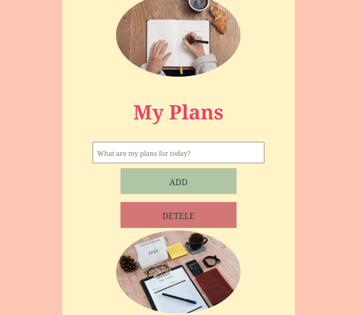

<h1>My plans</h1>

This app helps to create a list of one's plans for today

<h2> How to work with the app?</h2>
<ul>
<li>Type your plan in the window "What are my plas for today?".</li>
<li>Click on the button "ADD".</li>
<li>Repeate this two actions as many times as you need.</li>
<li>To cross out a plan click on it.</li>
<li>To clear the list click on the button "DELETE"</li>
</ul>
